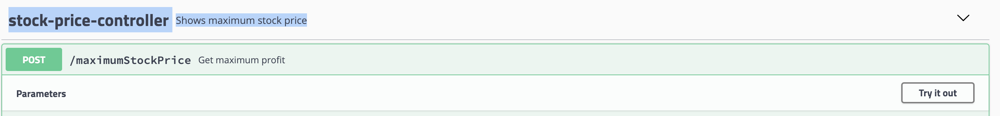
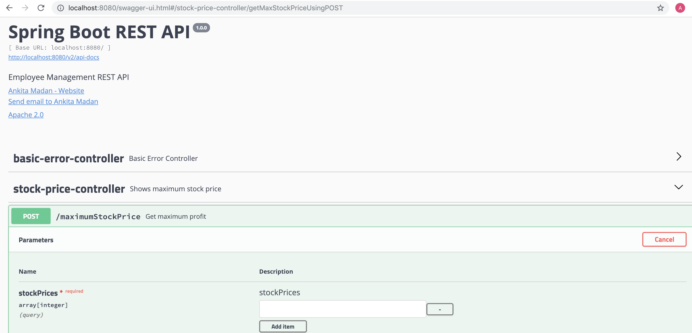
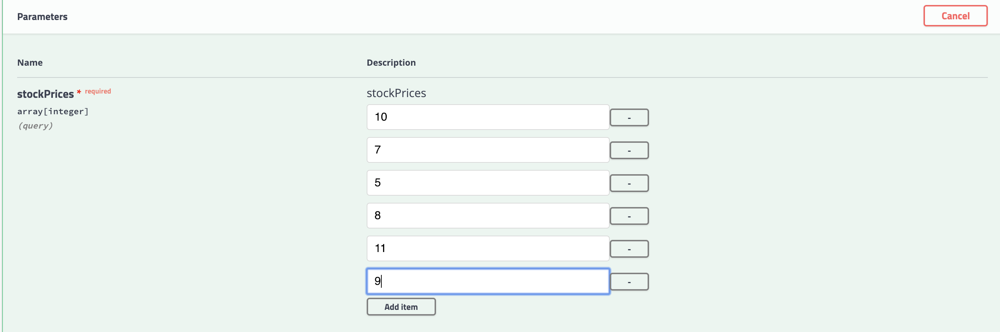
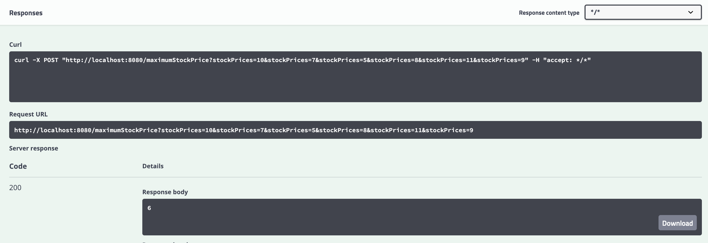
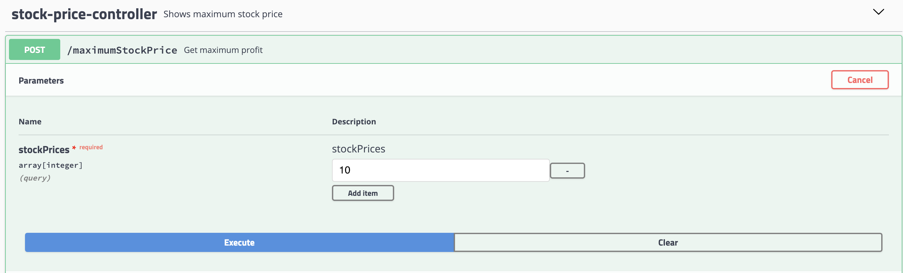
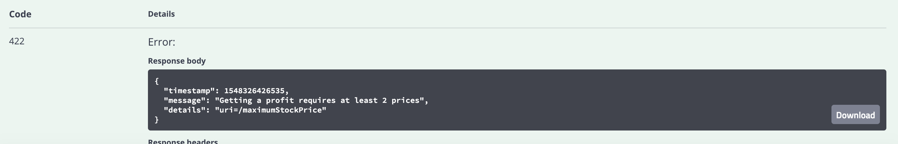

# Maximum Stock Price

### Prerequisites

Java 1.8


## Getting started
```bash
git clone https://github.com/ankitamadan/latitude-excercies.git
cd latitude-excercies
```

### Build locally

In your terminal run `./gradlew clean test build`

If this runs successfully we will have verified that your command line is setup correctly.

### Run locally

In your terminal run `./gradlew bootRun`. Then navigate to http://localhost:8080/swagger-ui.html in your browser
to test the app is running.

Steps

1. Click on http://localhost:8080/swagger-ui.html and there after stock-price-controller
2. Click on Try it out                                                               
- 
- 
3. Provide stock prices value and click add item
- 
4. Click on execute
5. Success response with 200 status
- 
6. Cancel the operation and remove all items in stock price but one
- 
7. Error response
- 
